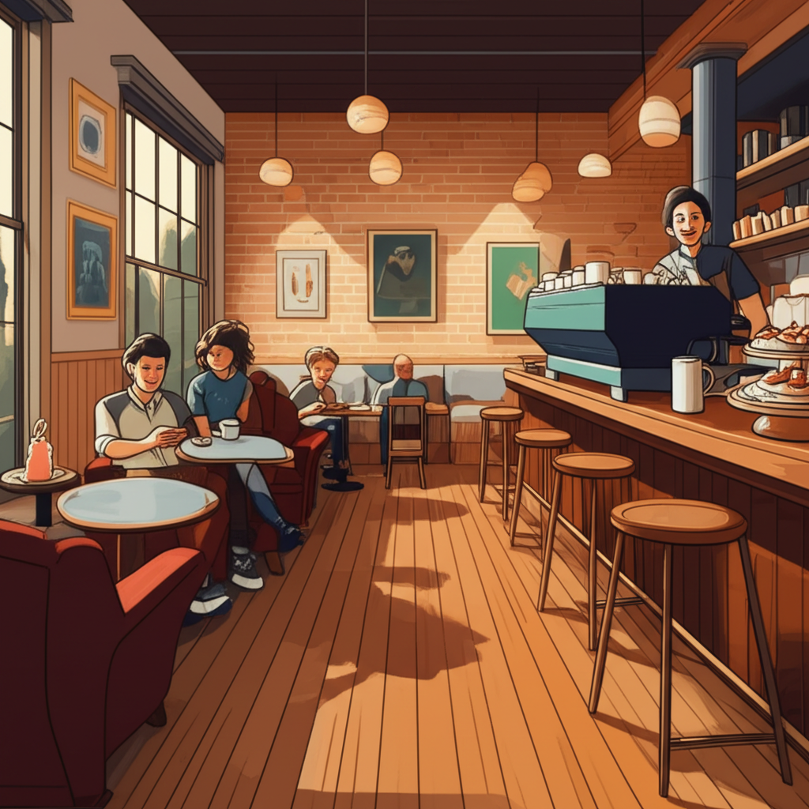

# ☕ Cafe Site

A modern, responsive website for a charming cafe, showcasing menu items, features, and contact information. Built with cutting-edge web technologies for a delightful user experience.



## 🚀 Features

- **Hero Section**: Eye-catching landing with welcoming visuals 🌟
- **Menu Section**: Display of delicious coffees, pastries, and sandwiches 🥐☕
- **About Section**: Learn about the cafe's story and ambiance 📖
- **Features Section**: Highlight unique offerings and atmosphere ✨
- **Contact Section**: Easy ways to reach out and connect 📞
- **Responsive Design**: Optimized for all devices, from mobile to desktop 📱💻
- **Theme Support**: Light and dark mode toggle for user preference 🌙☀️

## 🛠 Tech Stack


**Key Dependencies:**
- Next.js 15.2.4 for the React framework
- TypeScript for type safety
- Tailwind CSS for styling
- shadcn/ui components for UI consistency
- Radix UI primitives for accessibility
- Lucide React for icons
- Next Themes for theme switching

## 📦 Installation

1. **Clone the repository:**
   ```bash
   git clone https://github.com/your-username/cafe-site.git
   cd cafe-site
   ```

2. **Install dependencies:**
   ```bash
   npm install
   ```
   Or if using pnpm:
   ```bash
   pnpm install
   ```

3. **Run the development server:**
   ```bash
   npm run dev
   ```
   Or with pnpm:
   ```bash
   pnpm dev
   ```

4. **Open your browser:**
   Navigate to [http://localhost:3000](http://localhost:3000) to view the site.

## 📖 Usage

- **Development:** Use `npm run dev` to start the development server with hot reloading.
- **Build:** Run `npm run build` to create a production build.
- **Start:** Use `npm run start` to run the production server.
- **Lint:** Check code quality with `npm run lint`.

The site is structured with reusable components in the `components/` directory, pages in `app/`, and styles in `styles/`. Public assets are stored in `public/`.

## 🤝 Contributing

We welcome contributions! Here's how you can help:

1. Fork the repository
2. Create a feature branch (`git checkout -b feature/amazing-feature`)
3. Commit your changes (`git commit -m 'Add amazing feature'`)
4. Push to the branch (`git push origin feature/amazing-feature`)
5. Open a Pull Request

Please ensure your code follows the project's coding standards and includes appropriate tests.

## 📄 License

This project is private and proprietary.

## 📞 Contact

For questions or feedback, reach out via the contact section on the website or open an issue on GitHub.

---

Enjoy your coffee! ☕✨